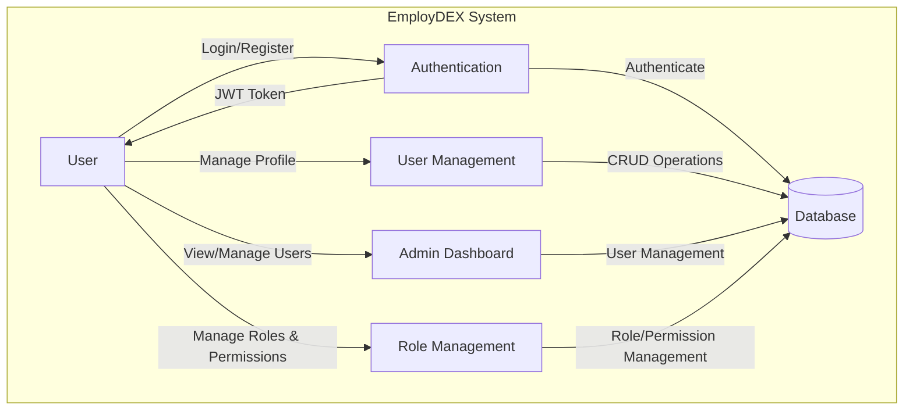
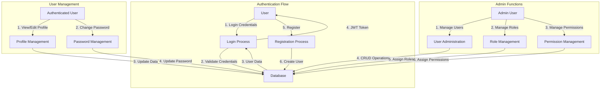

# EmployDEX - Data Flow Diagram (DFD)

## Level 0 (Context Diagram)

## Level 1 (Main Processes)

## Key Data Stores

1. **Users**
   - User credentials (hashed passwords)
   - Profile information
   - Account status

2. **Roles**
   - Role definitions
   - Role assignments

3. **Permissions**
   - Permission definitions
   - Permission assignments to roles

4. **Activity Logs**
   - User actions
   - System events
   - Security events

## External Entities

1. **Users**
   - Regular users
   - Admin users
   - System administrators

2. **External Services** (potential future integration)
   - Email service
   - File storage
   - Third-party authentication

## Data Flows

1. **Authentication**
   - Credentials → System → Validation → JWT Token
   - Registration Data → System → User Creation → Confirmation

2. **User Management**
   - Profile Updates → System → Database
   - Password Changes → System → Database (hashed)

3. **Administration**
   - User Management Commands → System → Database Updates
   - Role/Permission Changes → System → Database Updates

## Security Controls

1. **Authentication**
   - JWT-based authentication
   - Password hashing (bcrypt)
   - Token expiration

2. **Authorization**
   - Role-based access control (RBAC)
   - Permission checks for sensitive operations
   - Input validation

3. **Audit**
   - Activity logging
   - Security event monitoring

## Notes

- All sensitive data is encrypted in transit (HTTPS) and at rest
- API endpoints are protected with JWT authentication
- Admin functions require appropriate role-based permissions
- User sessions are managed using JWT tokens with expiration
